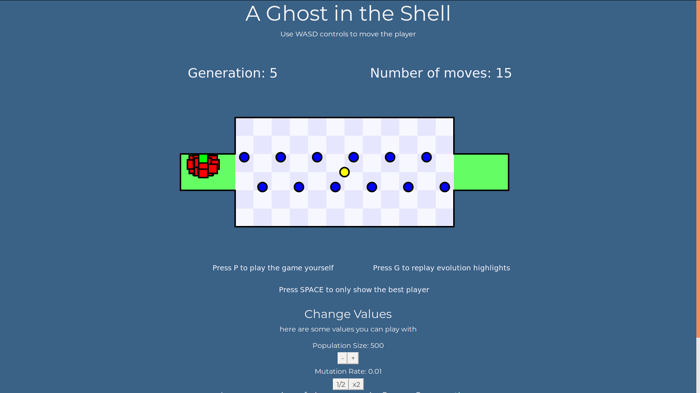

# GhostInTheShell
    An agent playing a map game!

## How to run
Just clone the repository and open `index.html`!

## About
We trained an agent to play a 2D map based game. The training was done using genetic algorithm and the player was made to win the game in the most optimal number of moves. We employed techniques like natural selection based on a fitness function, mutation of random members of the population, and K-point crossover between parents to create children every generation. The user is also given the ability to toggle parameters such as mutation rate, number of moves given to the agent per generation, and so on, so that they can observe the changes in the performance of the AI agent. Lastly, the user may also choose to play the game manually to see how they fare against the AI game playing agent.

## Group Members
- Ameya Salankar 2017A7PS0182H
- Harsh Kumar 2017A7PS1548H
- Mohammed Burk 2017A7PS0604H